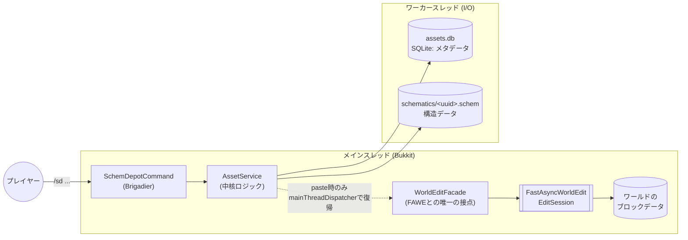

<div align="center">

# 📦 SchemDepot

**クリップボードを奪わず、建築を「サーバー全員の共有アセット」に変える。**

FastAsyncWorldEdit (FAWE) のクリップボードを、名前で呼び出せる共有アセットとしてサーバーに登録する Paper プラグインです。
`/sd <name>` で誰でも直接ペーストでき、ペーストしても本人・他プレイヤーいずれのクリップボードも一切変化しません。

<p>


</p>

</div>

---

## 📖 概要

- SchemDepot は WorldEdit/FAWE の**置き換えではありません**。FAWE の上に薄い共有レジストリ層を載せるだけのプラグインです。
- `//schem save` / `//schem load` はプレイヤー**個人**のファイル操作（自分の環境に保存・読込するだけ）ですが、SchemDepot の `/sd add` / `/sd <name>` は**サーバー全員が使える名前付きの共有アセット**を操作します。名前で引けること、誰が・いつ登録したかを他のプレイヤーも `list`/`info` で確認できることが違いです。
- `/sd <name>` でのペーストは**プレイヤー自身の WorldEdit クリップボードを一切書き換えません**。ペースト後もそれまでのクリップボードがそのまま残るので、`//undo` でペーストだけを取り消せます。

| | |
|---|---|
| 🔗 | **クリップボードを一切変更しない** — `/sd add` / `/sd <name>` はプレイヤーの WorldEdit クリップボードを読むだけで、書き換えません。ペースト後も `//undo` はペースト単体を取り消せます。 |
| 🗂 | **名前で引ける共有レジストリ** — 誰が・いつ登録したアセットかを `list` / `info` で誰でも確認できます。個人のファイル操作である `//schem save/load` との違いです。 |
| 🧵 | **メインスレッドをブロックしないI/O** — SQLite の読み書きとファイル I/O はすべてワーカースレッドで実行し、結果を必ずメインスレッドへ戻してから通知します。 |
| 🧱 | **FAWE への完全委譲** — ブロックの書き込みは `WorldEditFacade` 経由で FAWE の `EditSession` に一任し、SchemDepot 自身はワールドを直接触りません。 |
| 🔐 | **operation 単位の権限分離** — `.own` / `.any` の所有権判定、`list`/`info` のみ既定で全員開放など、ノードを細かく分けています。 |
| 🪶 | **軽量・単機能** — WorldEdit/FAWE の代替ではなく、その上に薄い共有レジストリ層を載せるだけの小さなプラグインです。 |

---

## 🛠 動作要件

| 項目 | バージョン |
|---|---|
| Paper / Purpur | 26.1.2 (build 74) 以降 |
| Java | 25 |
| FastAsyncWorldEdit | 2.15.3（**必須**） |

動作確認環境: Paper 26.1.2 (build 74) + FastAsyncWorldEdit 2.15.3 + Java 25。本番想定は Debian 12 上の Purpur 26.1.2 です。

> [!NOTE]
> FastAsyncWorldEdit は `paper-plugin.yml` 上で `required: true` かつ `load: BEFORE` の依存として宣言されています。導入されていない、あるいは起動順が異なる場合 SchemDepot は正常に動作しません。

---

## 📥 インストール

1. FastAsyncWorldEdit 2.15.3 以上を先に `plugins/` に導入します。
2. `SchemDepot-1.0.0.jar` を `plugins/` に配置します。
3. サーバーを起動します。初回起動時に `plugins/SchemDepot/` 以下が自動生成されます。

```text
plugins/SchemDepot/
├── config.yml         # 設定ファイル
├── assets.db          ★ アセットのメタデータ (SQLite) — バックアップ対象
├── schematics/         ★ 登録済みスキマティクス本体 (<uuid>.schem) — バックアップ対象
├── tmp/                  # 書き込み中の一時ファイル
└── trash/                # 削除時の一時退避先
```

アセットの表示名（プレイヤーが `/sd` で指定する名前）と、裏側のファイル名（`<uuid>.schem`）は分離されています。そのため `/sd rename` で表示名を変えても、`schematics/` 内のファイル名は変わりません。

---

## 🚀 使い方

典型的なフローは次の通りです。

```text
//copy                       # 範囲を選択してコピー（FAWEの通常操作）
/sd add MyBuilding           # クリップボードを "MyBuilding" として登録
/sd MyBuilding                # 誰でも /sd <name> で直接ペースト
//undo                          # ペースト自体は通常のWorldEdit操作として取り消せる
```

> [!TIP]
> `/sd add` した後もプレイヤー自身のクリップボードは変化しません。同様に `/sd <name>` でのペーストも、ペーストした本人・他のプレイヤーいずれのクリップボードも書き換えません。`//copy` した内容は `/sd` を何回挟んでも手元に残り続けます。

### 出力イメージ

画像の代わりに、実際のメッセージ書式（`Messages.kt`）に忠実な出力例です。

```text
> /sd list
┌──────────────────────────────────────────────────────────┐
│ SchemDepot — Assets 1/2                                  │  ← 金色 (GOLD)
│                                                          │
│ OakTree          warasugi       13x18x12                 │  ← 水色 (AQUA)
│ StoneBridge      warasugi       9x5x40                   │     クリックで /sd <name> を補完
│ SpawnPlatform    Notch          32x1x32                  │     ホバーで Author/Created/Size
└──────────────────────────────────────────────────────────┘

> /sd info OakTree
Name: OakTree
Author: warasugi
Created: 2026-08-10 21:45
Size: 13 x 18 x 12
```

`list` の各行は `"%-16s %-14s %dx%dx%d"`（名前 / 登録者 / サイズを `x` 区切りで連結）というコンパクトな書式で、`info` やホバーテキストでは同じサイズが `13 x 18 x 12` のようにスペース区切りで表示されます。両方とも UUID や実ファイルパスは一切表示しません。

---

## ⌨ コマンド一覧

ルートコマンドは `/schemdepot`、エイリアスは `/sd` です（実サーバーに登録されるラベルは `schemdepot`, `sd`, `schemdepot:schemdepot`, `schemdepot:sd`）。以下は `/sd` 表記で記載します。

| コマンド | 説明 | 必要な権限 | プレイヤー専用 |
|---|---|---|---|
| `/sd`, `/sd help` | ヘルプを表示 | `schemdepot.use` | - |
| `/sd add <name>` | 自分の WorldEdit クリップボードを `<name>` として登録 | `schemdepot.add` | ✓ |
| `/sd paste <name>` | 登録済みアセット `<name>` をペースト | `schemdepot.paste` | ✓ |
| `/sd <name>` | `/sd paste <name>` のショートカット | `schemdepot.paste` | ✓ |
| `/sd list [page]` | 登録済みアセットの一覧を表示 | `schemdepot.list` | - |
| `/sd info <name>` | アセット `<name>` の詳細（作成者・作成日時・サイズ）を表示 | `schemdepot.info` | - |
| `/sd rename <name> <new-name>` | アセットをリネーム | `schemdepot.rename.own`（自分が登録したもの）または `schemdepot.rename.any`（誰のものでも） | - |
| `/sd remove <name>` | アセットを削除 | `schemdepot.remove.own`（自分が登録したもの）または `schemdepot.remove.any`（誰のものでも） | - |

`add` / `paste` / `/sd <name>` はコンソールから実行できません（プレイヤーの位置・クリップボードが必要なため）。`rename`/`remove` をコンソールから実行した場合は常に `.any` 権限が必要になります（コンソールは特定のプレイヤーの所有物にはなり得ないため）。

---

## 🔑 権限一覧

| 権限ノード | 説明 | デフォルト |
|---|---|---|
| `schemdepot.use` | `/schemdepot`（`/sd`）ルートコマンドとヘルプの利用 | `true`（全員） |
| `schemdepot.list` | `/sd list` でアセット一覧を閲覧 | `true`（全員） |
| `schemdepot.info` | `/sd info` でアセット詳細を閲覧 | `true`（全員） |
| `schemdepot.paste` | `/sd <name>` / `/sd paste <name>` でワールドにペースト | `op` |
| `schemdepot.add` | `/sd add` でクリップボードをアセットとして登録 | `op` |
| `schemdepot.rename.own` | 自分が登録したアセットのリネーム | `op` |
| `schemdepot.rename.any` | 誰が登録したアセットでもリネーム | `op` |
| `schemdepot.remove.own` | 自分が登録したアセットの削除 | `op` |
| `schemdepot.remove.any` | 誰が登録したアセットでも削除 | `op` |
| `schemdepot.admin` | 上記すべての権限を一括付与 | `op` |

`schemdepot.list` と `schemdepot.info` は読み取り専用（ファイルパスや内部 UUID は表示しない）なのでデフォルト `true` です。それ以外の操作系ノードはワールドの書き換え・ディスク消費・共有レジストリの変更を伴うため `op` がデフォルトです。

各操作ノードは子として `schemdepot.use` を持つため、例えば `schemdepot.paste` だけを付与すればルートコマンドの `requires(schemdepot.use)` も同時に満たされ、単独付与だけで動作します。`schemdepot.admin` は全ノードを子に持ち、実際にすべての権限を一括付与します。

---

## 🏷 アセット名のルール

`AssetName.kt` で定義されている規則です。

- 正規表現 `^[A-Za-z0-9][A-Za-z0-9._-]{0,63}$` に一致すること（先頭は英数字、以降 63 文字まで英数字・`.`・`_`・`-`）。パス区切り文字や空白、`..` などは使えません。
- 大文字小文字は区別されません（`Locale.ROOT` で正規化して比較されるため、`OakTree` と `oaktree` は同じ名前として扱われます）。
- 以下 10 語は予約語としてアセット名に使用できません: `help`, `add`, `paste`, `list`, `info`, `rename`, `remove`, `reload`, `version`, `admin`

---

## ⚙️ 設定リファレンス (`config.yml`)

| キー | デフォルト | 説明 |
|---|---|---|
| `storage.database-file` | `assets.db` | アセットレジストリ（メタデータ）を保持する SQLite データベースファイル名 |
| `storage.schematics-directory` | `schematics` | 登録済みスキマティクス (`.schem`) の保存ディレクトリ |
| `storage.temp-directory` | `tmp` | 書き込み中の一時ファイルの保存ディレクトリ |
| `storage.trash-directory` | `trash` | 削除時の一時退避先ディレクトリ |
| `list.page-size` | `8` | `/sd list` の1ページあたりの表示件数 |
| `paste.ignore-air-by-default` | `false` | `true` にすると空気ブロックを無視してペーストする（WorldEdit `-a` 相当） |
| `paste.include-entities` | `false` | `true` にするとエンティティも含めてペーストする |
| `paste.include-biomes` | `false` | `true` にするとバイオーム情報も含めてペーストする |
| `limits.max-volume` | `0` | アセット登録時のクリップボード体積（バウンディングボックスのブロック数）上限。`0` は無制限（FAWE/サーバー側の制限にのみ従う） |

`storage.*` の4項目はプラグインのデータフォルダ直下に置く単一のファイル/ディレクトリ名でなければなりません。絶対パスやドライブレター、`/`・`\`・`:` を含む値、`.`・`..` はすべて拒否されます。不正な値は起動時に `WARNING` ログを出したうえでデフォルト値にフォールバックします（設定ファイルの記述ミスがサーバー起動を止めることはありません）。同様に `list.page-size` が1未満、`limits.max-volume` が負の値の場合もデフォルトにフォールバックしつつ `WARNING` を出します。

---

## 🧩 アーキテクチャ



`AssetService` が全操作の中核で、メタデータ（SQLite: `assets.db`）と構造データ（`schematics/<uuid>.schem`）を分離して管理します。`add`/`paste` はメインスレッドでプレイヤー状態を読んだ後にワーカースレッドへ処理を委譲し、結果は必ずメインスレッドへ戻してからチャット送信します。ワールドへのブロック書き込みは `WorldEditFacade` を介して FAWE の `EditSession` に完全委譲しており、SchemDepot 自身はブロックを直接触りません。

> 詳細なスレッドモデル・データモデルは [`docs/SchemDepot_DESIGN.md`](docs/SchemDepot_DESIGN.md) の SS12（スレッド）・SS15（コンポーネント構成）を参照してください。

---

## ⚠️ 制限について

このプラグイン最大の特徴は「クリップボードを奪わない」ことですが、それ以外の面では **v1.0 時点で意図的にスコープを絞っています。** 導入前に必ずお読みください。

> [!WARNING]
> - SchemDepot v1.0 には **アセット数・合計ディスク容量・1件あたりのサイズ・実行レートのいずれにも上限がありません。**
> - `limits.max-volume` の**デフォルトは `0`（無制限）**です。設定した場合もバウンディングボックスの**体積のみ**を見るため、シュルカーボックスや大量の本を詰め込んだ棚など、**体積は小さいのに NBT データが巨大**な構造物は制限できません。
> - これは身内向け建築サーバーでの利用を想定した v1.0 の意図的なスコープです。不特定多数が使う公開サーバーで運用する場合は、別途クォータやレート制限の仕組みを実装・導入してください。

> [!CAUTION]
> 🔒 上記の理由から、**`schemdepot.add` 権限は信頼できるメンバーにのみ付与してください。** 悪意あるユーザーが巨大な範囲を連続で `/sd add` すると、ディスクを使い切りサーバー全体が停止し得ます。

---

## 💾 バックアップ

`plugins/SchemDepot/assets.db`（メタデータ）と `plugins/SchemDepot/schematics/`（構造データ）は対になっています。**両方をセットでバックアップ・復元**してください。片方だけでは復元できません（`assets.db` だけではファイル実体がなく、`schematics/` だけでは名前や作成者などのメタデータが失われます）。

---

## 🔧 開発・ビルド

```sh
./gradlew build
```

成果物は `build/libs/SchemDepot-1.0.0.jar`（Shadow プラグインによる shaded jar、SQLite JDBC ドライバなどの依存を同梱）です。同じディレクトリに `SchemDepot-1.0.0-thin.jar`（依存を含まない素の jar）も生成されますが、こちらは配布・導入対象ではありません。

> [!WARNING]
> **サーバーを起動したままビルドすると、実行中の jar がロックされて壊れた成果物になることがあります。ビルド前には必ずサーバーを停止してください。**

テストサーバーを立てて動作確認する場合:

```sh
./gradlew runServer
```

Paper 26.1.2 と FastAsyncWorldEdit 2.15.3 を自動でダウンロードして起動します。

### 主要なソースファイル

```text
src/main/kotlin/io/github/potetogroove/schemdepot/
├── SchemDepotPlugin.kt          ★ プラグイン起動・DI配線のエントリポイント
├── command/
│   └── SchemDepotCommand.kt     ★ /schemdepot (/sd) の Brigadier コマンドツリー
├── asset/
│   ├── AssetService.kt          ★ add/paste/list/info/rename/remove の中核ロジック
│   └── AssetName.kt             ★ アセット名の正規表現・予約語・大小文字正規化
├── worldedit/
│   ├── WorldEditFacade.kt       ★ FAWE/WorldEdit API との唯一の接点
│   ├── ClipboardService.kt        # プレイヤークリップボードの読み取り専用アクセス
│   └── PasteService.kt            # .schem の読み込みとペースト実行
├── storage/
│   └── SqliteAssetRepository.kt   # SQLite への永続化
├── config/
│   └── SchemDepotConfig.kt        # config.yml のロードと検証
└── message/
    └── Messages.kt                 # プレイヤー向けメッセージの一元管理
```

---

## ✅ テスト

`./gradlew test` で112件のテストが実行されます（うち1件は実行環境に依存するためスキップされる場合があります。例: Windows でシンボリックリンクを作成するテストは管理者権限が無い環境ではスキップされます）。

---

## 📚 設計ドキュメント

コマンド仕様・データモデル・スレッドモデル・障害時の挙動などの詳細は [`docs/SchemDepot_DESIGN.md`](docs/SchemDepot_DESIGN.md) を参照してください。

---

## 📝 あとがき

身内の建築鯖で `//schem save` / `//schem load` を使うたび、「これ結局自分のPCにしか無いファイルだよな」と地味に不便を感じていたのが発端です。誰かが作った建物を別の誰かがサッと呼び出せる、名前付きの共有棚が欲しかっただけなんですが、気付いたらこうなってました、これで簡単に細かいものを共有できてQOL上昇だね。クリップボードを奪わないことにはやたら執着したので、そこだけは自信を持ってお勧めできます。

---

<div align="center">
<sub>SchemDepot is licensed under the <a href="LICENSE">MIT License</a>.</sub>
</div>
